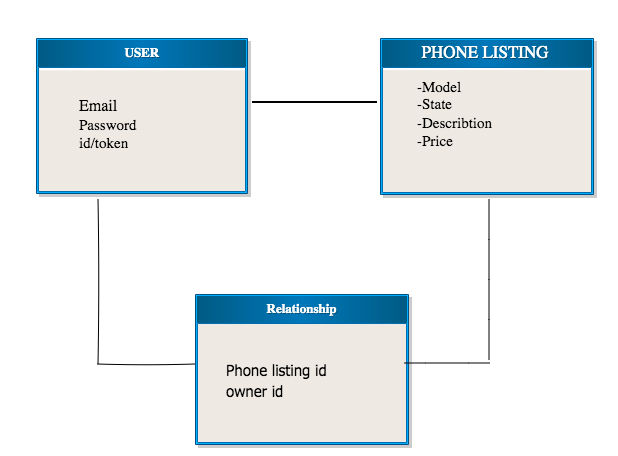

# Phone Exchange: E-commerce React App

This is a single page E-commerce application that allows users to exchange electronics products with other users. Once the user registered with an email adress and passwored, they will have an access to upload the choice of thiers' electronics products with a listing of the items' name, model, state describtion and price. The user can create many resources and be able to see in their cart, update and delete. Users can only mangae thier own products and do not have an access to make a change on others' users products.

## Link
- Live site: https://mk1366.github.io/Capstone-Client/#/
- Api Repository: https://github.com/mk1366/React-api
- Live Api: https://boiling-lake-07501.herokuapp.com/

## Techonologies
- React
- Express
- Mongoose
- MongoDB
- Bootstraps
- CSS
- Git
- Curl Script
- HTML5
- JSX
- Node.js
- psotman

## Setup

1. Fork & Clone or download this repository
2. install dependencies with npm install
3. Run local server with npm start

## Resource Routes
#### USER ROUTES
| HTTP      | CRUD     | URI Pattern   |  Controller#Action |
| ------------- |:-------------:| -----:|-----:|
| POST  | CREATE  | /sign-up | users#signup |
|POST |CREATE |/sign-in |users#signin|
| PATCH | UPDATE | /change-password |  users#changepw|
|  DELETE| DELETE | /sign-out |  users#signout|

#### Phone ROUTES
| HTTP      | CRUD     | URI Pattern   |  Controller#Action |
| ------------- |:-------------:| -----:|-----:|
| GET  | READ  | /phones | phones#index |
| POST  | CREATE  | /phones | phones#create |
| PATCH | UPDATE | /phones/:id |  phones#update|
|  DELETE| DELETE | /phones/:id |  phones#destroy|

## Future Goals

Eventually, I would like to add functionality and use Redux state management tool, to allows users to be able to exchange products with multiple users and a payment method to purchase the products.

## ERD + Wireframe

